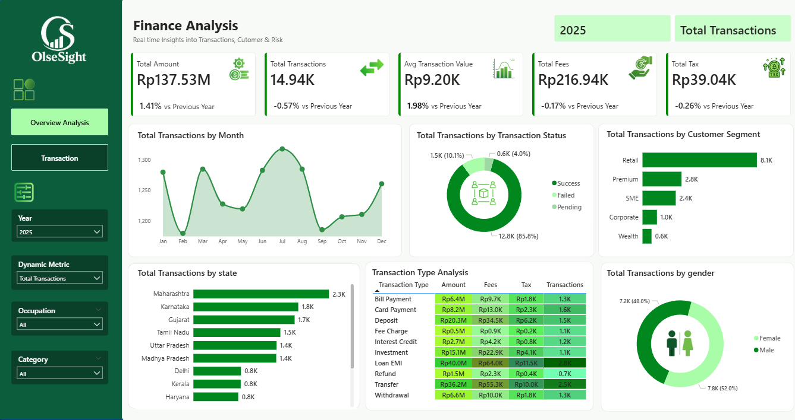
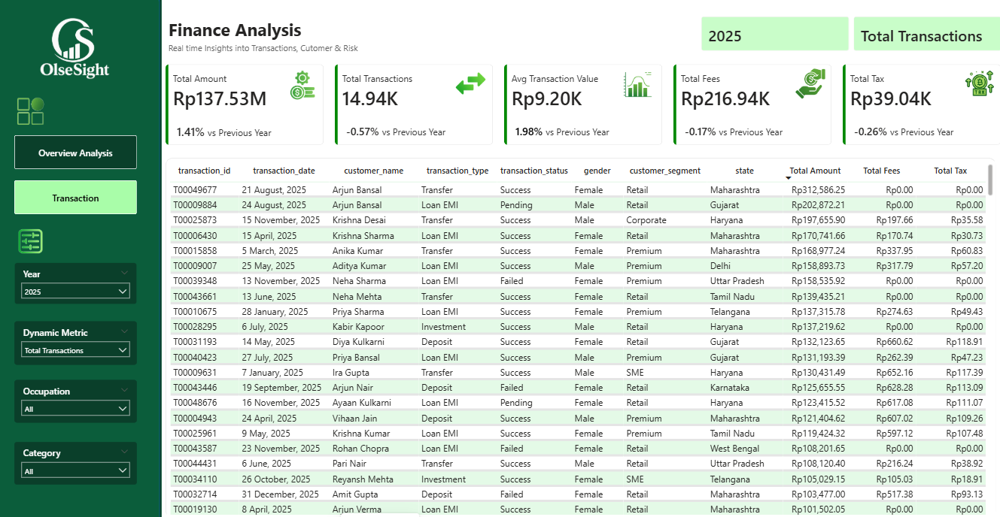
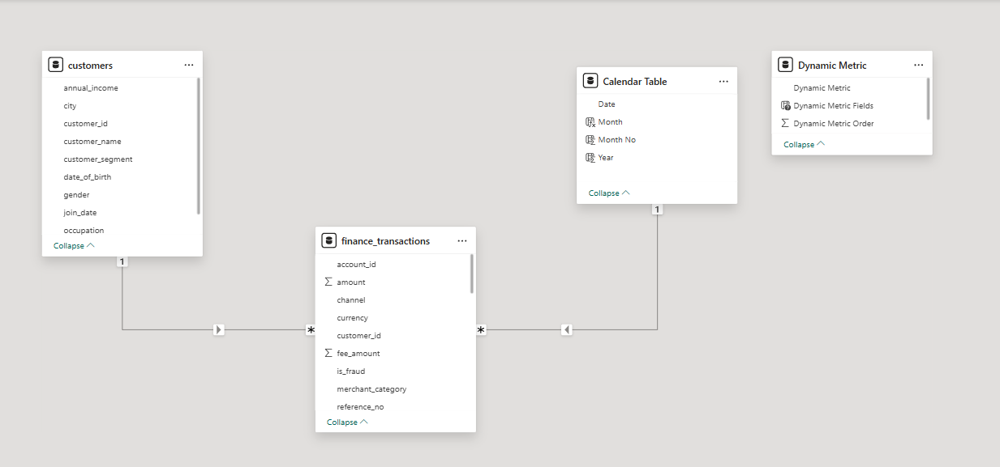

# Finance Analysis Dashboard using Power BI
# Dashboard Preview




## Project Overview

Finance Analysis Dashboard merupakan project Business Intelligence yang dikembangkan menggunakan Microsoft Power BI untuk menganalisis performa transaksi keuangan secara interaktif.

Dashboard ini dirancang untuk mengubah data transaksi yang kompleks menjadi visualisasi yang lebih mudah dipahami sehingga pengguna dapat memperoleh insight bisnis secara lebih cepat. Melalui dashboard ini, pengguna dapat memantau performa transaksi, memahami pola transaksi pelanggan, menganalisis segmentasi pelanggan, serta melihat distribusi transaksi berdasarkan wilayah.

Project ini menerapkan konsep Business Intelligence mulai dari data preparation, data modeling, pembuatan KPI, hingga visualisasi dashboard interaktif.


## Objectives

Tujuan utama project ini adalah:

- Menyajikan visualisasi analisis transaksi keuangan secara interaktif
- Mempermudah monitoring performa transaksi melalui KPI utama
- Mengidentifikasi pola transaksi berdasarkan waktu, wilayah, dan jenis transaksi
- Menganalisis segmentasi pelanggan untuk memahami kontribusi setiap segmen
- Mendukung pengambilan keputusan berbasis data


## Dataset

Project ini menggunakan dua dataset utama:

### 1. Finance Transactions Dataset
Dataset ini berisi informasi terkait aktivitas transaksi keuangan dan digunakan sebagai **fact table**.

Atribut utama:
- transaction_id
- customer_id
- transaction_date
- transaction_type
- transaction_status
- amount
- fee_amount
- tax_amount

Dataset ini digunakan untuk menghitung berbagai KPI seperti total transaksi, total amount, fees, dan tax.

### 2. Customers Dataset
Dataset ini digunakan untuk mendukung analisis segmentasi pelanggan.

Atribut utama:
- customer_id
- customer_name
- gender
- occupation
- customer_segment
- state

Melalui dataset ini, analisis dapat dilakukan berdasarkan karakteristik pelanggan seperti segmentasi, gender, maupun wilayah.

### Supporting Tables
Selain dua dataset utama, Power BI model juga menggunakan:

- Calendar Table → untuk analisis berbasis waktu
- Dynamic Metric Table → untuk metric selection secara dinamis

### Dataset References

Referensi dataset diperoleh dari sumber publik berikut:

Financial Transactions Dataset for Fraud Detection
https://www.kaggle.com/datasets/aryan208/financial-transactions-dataset-for-fraud-detection/data

Customer Segmentation Dataset
https://www.kaggle.com/datasets/syntheticprogrammer/customer-segmentation


## Why Synthetic Dataset

Dataset final yang digunakan dalam project ini merupakan synthetic dataset (dataset sintetis) yang telah disesuaikan dengan kebutuhan analisis dashboard.

Penggunaan dataset sintetis dipilih karena:

### 1. Financial data is sensitive
Data finansial asli umumnya memiliki tingkat kerahasiaan yang tinggi karena dapat memuat informasi sensitif seperti identitas pelanggan, histori transaksi, dan detail keuangan.

### 2. Public datasets are limited
Dataset publik sering kali memiliki keterbatasan seperti:
- atribut tidak lengkap
- struktur data berbeda
- tidak sesuai dengan kebutuhan dashboard

### 3. Better fit for analysis
Dataset sintetis memungkinkan penyesuaian struktur data agar:
- relationship antar tabel lebih optimal
- KPI lebih relevan
- visualisasi lebih representatif

Dengan demikian, dataset sintetis menjadi alternatif yang lebih aman namun tetap representatif untuk kebutuhan analisis Business Intelligence.


## Data Cleaning

Sebelum proses analisis, dilakukan tahapan data cleaning untuk memastikan kualitas data.

Tahapan yang dilakukan:

- Memeriksa missing values
- Mengecek konsistensi tipe data
- Menghapus atribut yang tidak digunakan
- Memperbaiki format tanggal
- Menormalisasi format numerik

Tujuan data cleaning adalah memastikan data siap untuk dianalisis dan meminimalkan error pada visualisasi maupun perhitungan KPI.


## Data Modeling

Setelah data dibersihkan, langkah berikutnya adalah membangun model data di Power BI.

Model data menggunakan pendekatan sederhana menyerupai **star schema**.

### Fact Table
- finance_transactions

### Dimension Tables
- customers
- calendar table
- dynamic metric

### Relationship

customers[customer_id]  
→ finance_transactions[customer_id]

calendar[date]  
→ finance_transactions[transaction_date]

Relationship ini memungkinkan analisis lintas tabel dapat dilakukan secara akurat.

---

## DAX Measures

Project ini menggunakan **DAX (Data Analysis Expressions)** untuk membuat KPI dan perhitungan analitis.

### Total Amount
```DAX
Total Amount = SUM(finance_transactions[amount])
```

### Total Transactions
```DAX
Total Transactions = COUNT(finance_transactions[transaction_id])
```

### Average Transaction Value
```DAX
Average Transaction Value =
DIVIDE([Total Amount], [Total Transactions])
```

### Total Fees
```DAX
Total Fees = SUM(finance_transactions[fee_amount])
```

### Total Tax
```DAX
Total Tax = SUM(finance_transactions[tax_amount])
```

DAX memungkinkan KPI berubah secara dinamis sesuai filter yang dipilih pengguna.


## Dashboard Insights

Berdasarkan hasil analisis dashboard, diperoleh beberapa insight utama:

### Total Transaction Volume
Jumlah transaksi mencapai sekitar 14.94K transaksi

### Transaction Value
Total nilai transaksi mencapai Rp137.53 juta

### Transaction Success Rate
Sekitar 85% transaksi berhasil diproses

### Customer Segment
Segmen Retail menjadi kontributor transaksi terbesar

### Geographic Distribution
Wilayah Maharashtra memiliki aktivitas transaksi tertinggi

Secara keseluruhan, dashboard ini menunjukkan bagaimana Business Intelligence dapat mengubah data transaksi yang kompleks menjadi insight yang lebih mudah dipahami.
